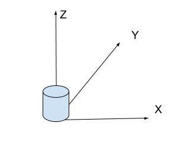
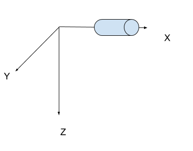
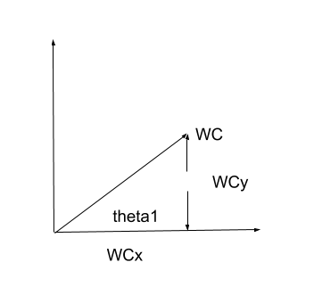
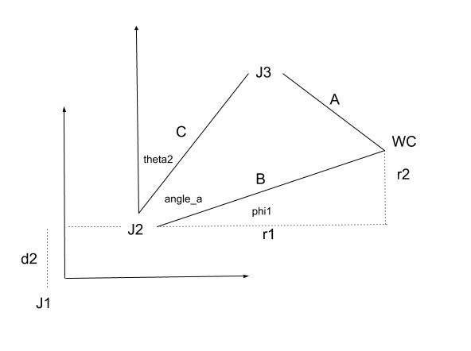
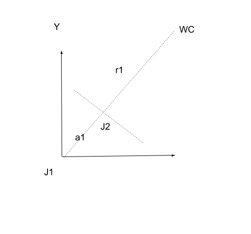
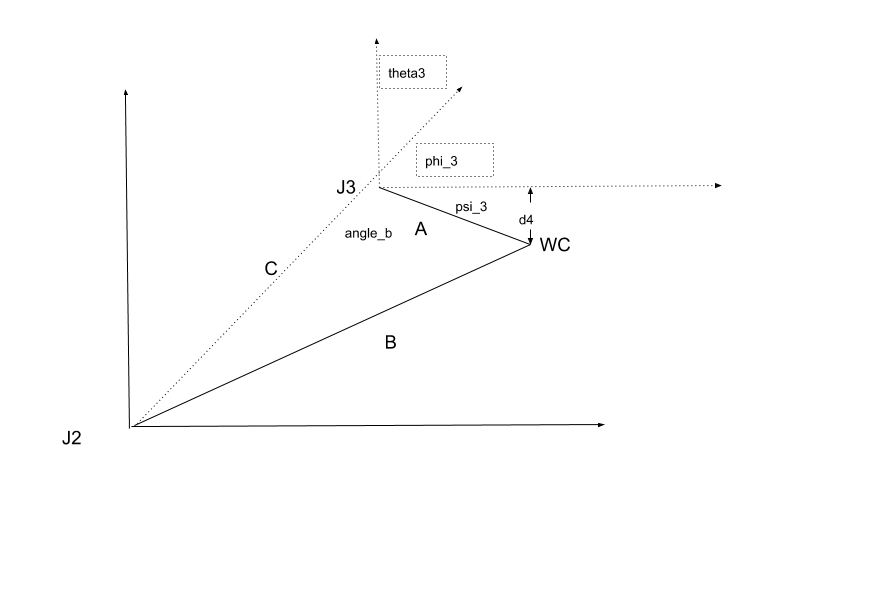
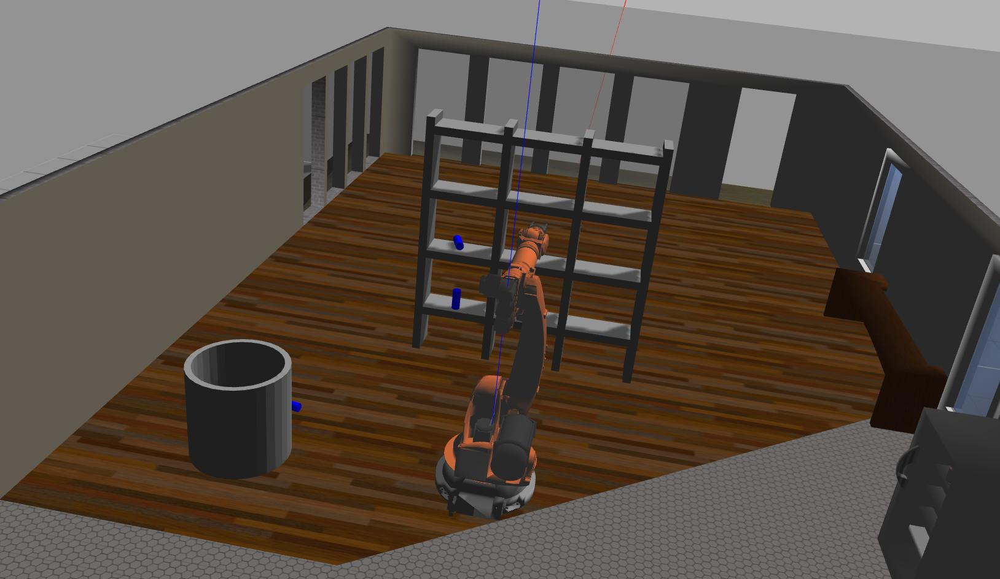
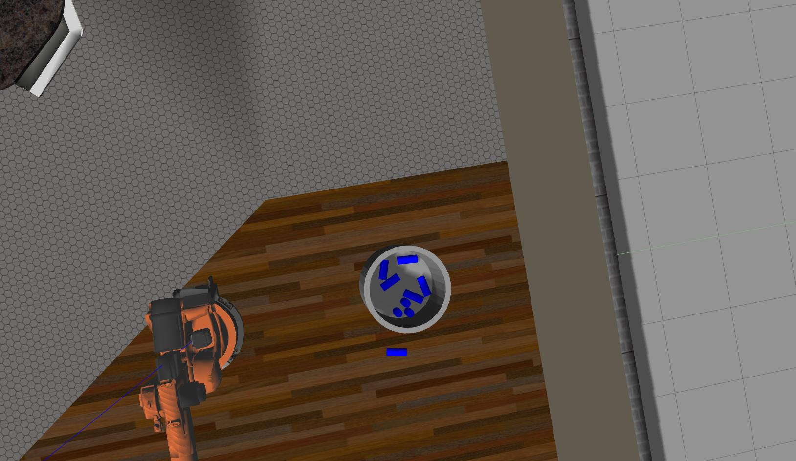

Project: Kinematics Pick & Place
--------------------------------

### Writeup Template: You can use this file as a template for your writeup if you want to submit it as a markdown file, but feel free to use some other method and submit a pdf if you prefer. {#writeup-template-you-can-use-this-file-as-a-template-for-your-writeup-if-you-want-to-submit-it-as-a-markdown-file-but-feel-free-to-use-some-other-method-and-submit-a-pdf-if-you-prefer}

------------------------------------------------------------------------

**Steps to complete the project:**

1.  Set up your ROS Workspace.
2.  Download or clone the [project
    repository](https://github.com/udacity/RoboND-Kinematics-Project)
    into the ***src*** directory of your ROS Workspace.
3.  Experiment with the forward\_kinematics environment and get familiar
    with the robot.
4.  Launch in [demo
    mode](https://classroom.udacity.com/nanodegrees/nd209/parts/7b2fd2d7-e181-401e-977a-6158c77bf816/modules/8855de3f-2897-46c3-a805-628b5ecf045b/lessons/91d017b1-4493-4522-ad52-04a74a01094c/concepts/ae64bb91-e8c4-44c9-adbe-798e8f688193)
    .
5.  Perform Kinematic Analysis for the robot following the [project
    rubric](https://review.udacity.com/#!/rubrics/972/view) .
6.  Fill in the `      IK_server.py     ` with your Inverse Kinematics
    code.

[Rubric](https://review.udacity.com/#!/rubrics/972/view) Points
---------------------------------------------------------------

### Here I will consider the rubric points individually and describe how I addressed each point in my implementation. {#here-i-will-consider-the-rubric-points-individually-and-describe-how-i-addressed-each-point-in-my-implementation}

------------------------------------------------------------------------

### Writeup / README

#### 1. Provide a Writeup / README that includes all the rubric points and how you addressed each one. You can submit your writeup as markdown or pdf. {#1-provide-a-writeup-readme-that-includes-all-the-rubric-points-and-how-you-addressed-each-one-you-can-submit-your-writeup-as-markdown-or-pdf}

You’re reading it!

### Kinematic Analysis

#### 1. Run the forward\_kinematics demo and evaluate the kr210.urdf.xacro file to perform kinematic analysis of Kuka KR210 robot and derive its DH parameters. {#1-run-the-forward_kinematics-demo-and-evaluate-the-kr210urdfxacro-file-to-perform-kinematic-analysis-of-kuka-kr210-robot-and-derive-its-dh-parameters}

We follow the rules for generating the DH parameters. The urdf indicates
joint1 has a z offset of 0.33 and joint2 has a z offset of 0.42 and an x
offset of 0.35. We move the joint1 origin to the accumulated z to
provide a d1 of 0.75. We then twist the joint -90deg and translate 0.35
along the x axis resulting in alpha1=-pi/2 and a1=0.35, d2=0. We
translate along the z axis 1.25 to reach joint3 with no rotation. Joints
4,5,6 are will have a coincident origin as they form the spherical
wrist. We rotate -pi/2 to orient in the joint4 configuration and apply a
translation of 0.96 + 0.54 for d4 and a3 has an offset of -0.054. A
twist of +pi/2 moves from joint4 to joint5. A final twist of -pi/2 moves
from joint5 to joint6. Finally, the end effector has d7 of 0.193 + 0.11
or 0.303 from the urdf.

#### 2. Using the DH parameter table you derived earlier, create individual transformation matrices about each joint. In addition, also generate a generalized homogeneous transform between base\_link and gripper\_link using only end-effector(gripper) pose. {#2-using-the-dh-parameter-table-you-derived-earlier-create-individual-transformation-matrices-about-each-joint-in-addition-also-generate-a-generalized-homogeneous-transform-between-base_link-and-gripper_link-using-only-end-effectorgripper-pose}

  Links      alpha(i-1)   a(i-1)   d(i-1)   theta(i)
  ---------- ------------ -------- -------- ------------
  0-&gt;1    0            0        0.75     0
  1-&gt;2    - pi/2       0.35     0        -pi/2 + q2
  2-&gt;3    0            1.25     0        0
  3-&gt;4    -pi/2        -0.054   1.50     0
  4-&gt;5    pi/2         0        0        0
  5-&gt;6    -pi/2        0        0        0
  6-&gt;EE   0            0        0.303    0

The generic transform looks like\
\$\$T\_{i-1,i} = \\begin{pmatrix} cos(q\_{i}) & -sin(q\_{i}) & 0 &
a\_{i-1} \\\\ sin(q\_{i})cos(alpha\_{i-1}) &
cos(q\_{i})cos(alpha\_{i-1}) & -sin(alpha\_{i-1}) &
-sin(alpha\_{i-1})d\_{i} \\\\ sin(q\_{i})sin(alpha\_{i-1}) &
cos(q\_{i})sin(alpha\_{i-1}) & cos(alpha\_{i-1}) &
cos(alpha\_{i-1})d\_{i} \\\\ 0 & 0 & 0 & 1 \\end{pmatrix}\$\$

For the T ~0,1~ matrix we substitute alpha\_ ~0~ =0, a ~0~ =0,d ~1~
=0.75 noting that cos(0) = 1 and sin(0) = 0 yields

\$\$T\_{0,1} = \\begin{pmatrix} cos(q1) & -sin(q1) & 0 & 0 \\\\ sin(q1)
& cos(q1) & 0 & 0 \\\\ 0 & 0 & 1 & 0.75 \\\\ 0 & 0 & 0 & 1
\\end{pmatrix}\$\$

For the T ~1,2~ matrix we substitute alpha ~1~ =-pi/2, a ~1~ =0.35,d ~2~
=0 noting that cos(-pi/2) = 0 and sin(-pi/2) = -1 yields

\$\$T\_{1,2} = \\begin{pmatrix} cos(q2) & -sin(q2) & 0 & 0.35 \\\\ 0 & 0
& 1 & 0 \\\\ -sin(q2) & -cos(q2) & 0 & 0 \\\\ 0 & 0 & 0 & 1
\\end{pmatrix}\$\$

For the T ~2,3~ matrix we substitute alpha ~2~ =-0, a ~2~ =1.25,d ~3~ =0
noting that cos(0) = 1 and sin(0) = 0 yields

\$\$T\_{2,3} = \\begin{pmatrix} cos(q3) & -sin(q3) & 0 & 1.25 \\\\
sin(q3) & cos(q3) & 0 & 0 \\\\ 0 & 0 & 1 & 0 \\\\ 0 & 0 & 0 & 1
\\end{pmatrix}\$\$

For the T ~3,4~ matrix we substitute alpha ~3~ =-pi/2, a ~3~ =-0.054,d
~4~ =1.50 noting that cos(-pi/2) = 0 and sin(-pi/2) = -1 yields

\$\$T\_{3,4} = \\begin{pmatrix} cos(q4) & -sin(q4) & 0 & -0.054 \\\\ 0 &
0 & 1 & 1.50 \\\\ -sin(q4) & -cos(q4) & 0 & 0 \\\\ 0 & 0 & 0 & 1
\\end{pmatrix}\$\$

For the T ~4,5~ matrix we substitute alpha ~4~ =pi/2, a ~4~ =0,d ~5~ =0
noting that cos(pi/2) = 0 and sin(pi/2) = 1 yields

\$\$T\_{4,5} = \\begin{pmatrix} cos(q5) & -sin(q5) & 0 & 0 \\\\ 0 & 0 &
-1 & 0 \\\\ sin(q5) & cos(q5) & 0 & 0 \\\\ 0 & 0 & 0 & 1
\\end{pmatrix}\$\$

For the T ~5,6~ matrix we substitute alpha ~5~ =-pi/2, a ~5~ =0,d ~6~ =0
noting that cos(-pi/2) = 0 and sin(-pi/2) = -1 yields

\$\$T\_{5,6} = \\begin{pmatrix} cos(q6) & -sin(q6) & 0 & 0 \\\\ 0 & 0 &
1 & 0 \\\\ -sin(q6) & -cos(q6) & 0 & 0 \\\\ 0 & 0 & 0 & 1
\\end{pmatrix}\$\$

For the T ~6,G~ matrix we substitute alpha ~6~ = 0, a ~6~ =0,d ~7~
=0.303 noting that cos(0) = 1 and sin(0) = 0 yields

\$\$T\_{6,G} = \\begin{pmatrix} cos(q7) & -sin(q7) & 0 & 0 \\\\ sin(q7)
& cos(q7) & 0 & 0 \\\\ 0 & 0 & 1 & 0.303 \\\\ 0 & 0 & 0 & 1
\\end{pmatrix}\$\$

The transform from the base link to the end effector is then\
\$\$T\_{0,G} =
T\_{0,1}T\_{1,2}T\_{2,3}T\_{3,4}T\_{4,5}T\_{5,6}T\_{6,G}\$\$

The input into the system is the roll, pitch, and yaw of the end
effector. We will transform the rotations about the end effector into
the total rotation required from the origin of our robot. Here is the
coordinate frame of our system:

and here is the coordinate frame of the end effector:

To transform the orientation of our world frame into that of the input
end effector rotations, we need to rotate 180 degrees about the z axis
to get the coordinate frames equivalent. Additionally, a rotation of -90
degrees about the y axis is required from the base revolute joint such
that the normal is in the direction of the end effector frame. We call
this matrix \$\$R\_{corr}\$\$ .

We define a sequence of extrinsic rotations in order to calculate the
end effector rotation.\
\$\$R\_{EE} = R\_{z}R\_{y}R\_{x}R\_{corr}\$\$

The rotations about \$\$R\_{z}, R\_{y}, and R\_{z}\$\$ are by the book
and are:

\$\$R\_{x} = \\begin{pmatrix} 1 & 0 & 0 \\\\ 0 & cos(r) & -sin(r) \\\\ 0
& sin(r) & cos(r) \\end{pmatrix}\$\$\
where *r* is the input roll.

\$\$R\_{y} = \\begin{pmatrix} cos(p) & 0 & sin(p) \\\\ 0 & 1 & 0 \\\\
-sin(p) & 0 & cos(p) \\end{pmatrix}\$\$\
where *p* is the input pitch.

\$\$R\_{z} = \\begin{pmatrix} cos(y) & -sin(y) & 0 \\\\ sin(y) & cos(y)
& 0 \\\\ 0 & 0 & 1 \\end{pmatrix}\$\$\
where *y* is the input yaw.

\$\$R\_{corr} = R\_{z,y=180deg} R\_{y,p=-90deg}\$\$\
\$\$R\_{z,y=180deg} = \\begin{pmatrix} -1 & 0 & 0 \\\\ 0 & -1 & 0 \\\\ 0
& 0 & 1 \\end{pmatrix}\$\$

\$\$R\_{y,p=-90deg} = \\begin{pmatrix} 0 & 0 & -1 \\\\ 0 & 1 & 0 \\\\ 1
& 0 & 0 \\end{pmatrix}\$\$

\$\$R\_{corr} = \\begin{pmatrix} 0 & 0 & 1 \\\\ 0 & -1 & 0 \\\\ 1 & 0 &
0 \\end{pmatrix}\$\$

at this point we have \$\$R\_{EE}\$\$ in the world coordinates and the
end effector position is also part of the input. Given the rotation of
the end effector and the length of the end effector, we can now define
the coordinates of the wrist center (WC). Lesson 15 defines the wrist
center equations as\
\$\$wc\_{x} = p\_{x} - (d\_{6} + l)n\_{x}\$\$\
\$\$wc\_{y} = p\_{y} - (d\_{6} + l)n\_{y}\$\$\
\$\$wc\_{z} = p\_{z} - (d\_{6} + l)n\_{z}\$\$

where the **n** vector may be extracted from the just calculated
\$\$R\_{EE}\$\$ to give the resulting **WC** position vector.

#### 3. Decouple Inverse Kinematics problem into Inverse Position Kinematics and inverse Orientation Kinematics; doing so derive the equations to calculate all individual joint angles. {#3-decouple-inverse-kinematics-problem-into-inverse-position-kinematics-and-inverse-orientation-kinematics-doing-so-derive-the-equations-to-calculate-all-individual-joint-angles}

We solve the inverse kinematics problem by considering the first three
joints as those that resolve the place the wrist center in the correct
position and the last three joints are those that specify the
orientation of the end effector. We will start by solving for theta1,
which happens to be the only joint to provide any rotation about the z
axis. We start by taking a top-down view of the robot in order to
calculate the required rotation about z in order to calculate theta1.

From here it is easy to solve for theta1.\
\$\$theta\_{1} = tan\^{-1}(\\frac{WC\_{y}}{WC\_{x}})\$\$

Next up, we move to theta2 and we will start with a side-view.

From this drawing we can see that\
\$\$theta\_{2} = pi/2 - phi\_{1} - angle\_a\$\$

Furthermore we can see that\
\$\$phi\_1 = tan\^{-1}(\\frac{r2}{r1})\$\$\
and from the law of cosines\
\$\$angle\_a = cos\^{-1}(\\frac{B\^2 + C\^2 - A\^2}{2BC})\$\$

Some of these components are immediately solvable:\
\$\$C = length\_{J2 to J3}\$\$\
and extracted from the DH table is\
\$\$C = 1.25\$\$

\$\$A = length\_{J3 to WC}\$\$\
\$\$A = \\sqrt{(-0.054)\^{2} + 1.50\^{2}}\$\$\
\$\$A \~= 1.501\$\$

\$\$r2 = WC\_{z} - d\_{1}\$\$\
\$\$r2 = WC\_{z} - 0.75\$\$

to solve for B and r1 requires we return to the top view.

In this coordinate frame we see that r1 is now the remaining distance to
the wrist center from joint1 once the length of a1 has been subtracted.

\$\$r1 = \\sqrt{WC\_{y}\^2 + WC\_{x}\^2} - a1\$\$\
\$\$B = \\sqrt{r1\^2 + r2\^2}\$\$

and now all required elements to solve for theta2 have been resolved.

We advance to joint3 to solve for theta3 in a similar manner.

From this drawing we can see that\
\$\$theta\_{2} = \\frac{pi}{2} - phi\_{3}\$\$

meanwhile we can see that\
\$\$pi = phi\_{3} + psi\_{3} + angle\_{b}\$\$\
or\
\$\$phi\_{3} = pi - psi\_{3} - angle\_{b}\$\$\
and\
\$\$psi\_{3} = sin\^{-1}(\\frac{d4}{A})\$\$\
where d4 is from the table and A was previously resolved.\
\$\$psi\_{3} = sin\^{-1}(\\frac{0.054}{1.501})\$\$\
resulting in\
\$\$psi\_{3} \~= 0.36\$\$

We an solve angle\_b from the law of cosines\
\$\$angle\_{b} = cos\^{-1}(\\frac{A\^2+C\^2 - B\^2}{2AC})\$\$\
and all unknowns are now resolved for theta3. However, the sign of
theta3 needs to be inverted to reflect the negative rotation. This
completes the inverse kinematics code for position determination.

We now move to the inverse kinematics of the orientation of the
spherical wrist. First, we already have the total orientation required
and we know the orientation applied to the end effector by the first
three joints. So, we will first solve for the required orientation
applied by the spherical wrist alone.\
\$\$R\_{3,6} = R\_{0,3}\^{-1}R\_{EE}\$\$\
where\
\$\$R\_{0,3} =
T\_{0,1;q1=theta1}T\_{1,2;q2=theta2}T\_{2,3;q3=theta3}\$\$\
Here we just applied the homogenous transforms using the solved
rotational angles for the first three joints to find the total
orientation contribution of the first three joints. Therefore, we have
also found the total orientation contribution required by the last three
joints and the problem is to now solve for the angles on each of the
last three joints.

The transform from joint3 to the wrist center is:\
\$\$T\_{3,6} = T\_{3,4}T\_{4,5}T\_{5,6}\$\$\
to make the matrix multiplications less daunting we will write “c4” to
mean cos(theta4) and “s4” to mean sin(theta4).\
\$\$T\_{3,6} = T\_{3,5}T\_{3,6}\$\$\
\$\$T\_{3,5} = T\_{3,4}T\_4{,5}\$\$\
\$\$T\_{3,5} = \\begin{pmatrix} c4c5 & -c4s5 & s4 \\\\ s5 & c5 & 0 \\\\
-s4c5 & s4s5 & c4 \\end{pmatrix}\$\$\
\$\$T\_{3,6} = \\begin{pmatrix} c4c5c6 - s4s6 & -c4c5s6 - s4c6 & -c4s5
\\\\ s5c6 & -s5s6 & c5 \\\\ -s4c5s6 - c4s6 & s4c5s6 - c4c6 & s4s5
\\end{pmatrix}\$\$

theta5 could be easily plucked out of the T3\_6\[1,2\] entry but the
guidance is to use the tangent allowing for the specification of
quadrants. Observe:\
\$\$(-c4s5)\^2 = R\_{3,6}\[0,2\]\^2\$\$\
\$\$(-s4s5)\^2 = R\_{3,6}\[2,2\]\^2\$\$\
then\
\$\$c4\^2s5\^2 + s4\^2s5\^2 = R\_{3,6}\[0,2\]\^2 +
R\_{3,6}\[2,2\]\^2\$\$\
\$\$s5\^2(c4\^2+s4\^2) = R\_{3,6\]\[0,2\]\^2 + R\_{3,6\]\[2,2\]\^2\$\$\
\$\$s5 = \\sqrt{R\_{3,6}\[0,2\]\^2 + R\_{3,6}\[2,2\]\^2}\$\$\
leading to\
\$\$theta5 = tan\^{-1}(\\frac{\\sqrt{R\_{3,6}\[0,2\]\^2 +
R\_{3,6}\[2,\]\^2}}{R\_{3,6}\[1,2\]})\$\$\
theta4 and theta6 are easier to resolve as\
\$\$theta4 = tan\^{-1}(\\frac{R\_{3,6}\[2,2\]}{-R\_{3,6}\[0,2\]})\$\$\
\$\$theta6 = tan\^{-1}(\\frac{-R\_{3,6}\[1,1\]}{R\_{3,6}\[1,0\]})\$\$

and all angles have now been resolved. The inverse kinematics problem is
complete.

### Project Implementation

#### 1. Fill in the `     IK_server.py    ` file with properly commented python code for calculating Inverse Kinematics based on previously performed Kinematic Analysis. Your code must guide the robot to successfully complete 8/10 pick and place cycles. Briefly discuss the code you implemented and your results. {#1-fill-in-the-ik_serverpy-file-with-properly-commented-python-code-for-calculating-inverse-kinematics-based-on-previously-performed-kinematic-analysis-your-code-must-guide-the-robot-to-successfully-complete-810-pick-and-place-cycles-briefly-discuss-the-code-you-implemented-and-your-results}

The result of this implementation was 8/10 successes. These results can
be seen in the following two images.\
\

The first image shows a target object that has fallen on its side and
the second image shows one target object not in the bin. The reason
behind the second failure is that the robot did not account for the
length of the target while orienting into the bin. The result was that
the target hit the side of the bin during one of the manuevers moving
the bin and the target fell to the ground. The first failure was a
similar result. The arm hit the target during orientation - before the
grasping stage. Both of these could be accounted for but are difficult
to consider in this scenario where we are given the required pose but
not the contextual information such as “am I already holding the
target”.
